**如果喜欢本项目，可以点个小心心~**

项目由——逸龙——独立完成，仍有部分不够完善，希望一同改进！

# 摘要

最新数据显示，目前海南省电动自行车保有量约为300万辆，且呈逐年上涨趋势。最新的2021年人口统计显示，海南省常住人口1008.12万人，这样计算下来，平均三人中就有一辆电动车。而对于海南大学海甸校区校内，更存在电动车管理混乱，宿舍楼宇之间数据孤岛等问题。

本文根据需求分析，基于Smobiler平台与C\#语言开发出了一款“校园电动车管理信息系统”的手机APP。系统使用Visual
Studio进行编写与调试并且利用PowerDesigner16.5对于数据库进行设计与建立。

在功能实现方面，针对用户端与管理员端，程序实现了登记车辆信息、修改车辆信息、查询车辆信息、留言等多种功能。此外为了防止不能及时联系上该同学，系统能够智能显示同宿舍同学的联系方式，便于管理者能够及时有效联系到车主。

虽然信息化的普及，但是校内较多基层人员对于电子产品使用存在学习壁垒，本文在对系统进行分析与设计的时候着重考虑到了系统的操作简易性。

# 系统概述

本章解释了研究本系统实现的原因并分析了电动车管理信息系统的主要功能及业务人员的需求，确立的系统的功能结构及系统的开发环境，同时也对软件系统的结构加以论述。为了精确需求，本文就海南大学为例进行相关调研分析。

## 背景简介与当前现状

数据显示，目前海南省电动自行车保有量约为300万辆，且呈逐年上涨趋势[1]。最新的2021年人口统计显示，海南省常住人口1008.12万人，这样计算下来，平均三人中就有一辆电动车。根据对海口市区的龙昆南、白龙南、人民路等交通路口观察可以发现，绝大部分时候电动车的数量是绝对多于步行行人数量的。

图 1 海口骑楼红绿灯过马路图片

在海南大学内（简称校内）虽然暂未有保有量数据，但是每逢上下课高峰期经常会出现“电动车堵车潮”，晚上10点后宿舍楼下电动车乱停乱放的电动车拥堵现象。根据对校内楼管、保卫处的访谈后发现，目前校内对于庞大数量的电动车管理虽然有“发放车牌”“登记信息”等方法，但总体仍然处于“手工管理”阶段。查阅相关资料会发现，在车辆管理中对于“汽车”与“摩托车”的研究较为多，但是鲜有对于“电动自行车”的相关研究需求研究与信息系统的分析与设计。

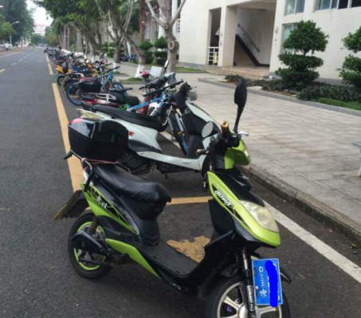

图 2 四教旁电动车停放图片

#  系统分析

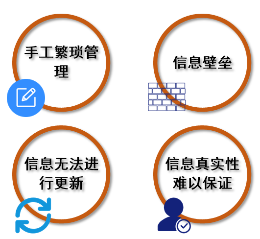

图 9 访谈存在问题分析

## 需求分析

### 系统用户

表格 1 系统用户角色与类型

| 序号 | 角色         | 用户类型 |
|------|--------------|----------|
| 1    | 电动车车主   | 用户     |
| 2    | 保卫处、楼管 | 管理员   |

注：楼管与保卫处人员的操作界面需要极其简单易懂，切勿复杂

### 功能描述

#### 平台的电动车管理系统用户端实现功能:

1.  登录功能:学员根据学号和密码登录个人账户。

2.  登记个人电动车车辆信息功能：用于登记电动车车辆信息。

3.  查看个人电动车辆信息功能:用户可以查看个人车辆信息。

4.  更新个人电动车车辆信息功能：用户转卖、遗失车辆、后进行操作。

5.  查看他人电动车车辆信息功能：根据他人车辆标识号，查看车辆信息。但不能查看完整姓名、完整电话。

6.  向他人电动车车辆留言功能：因为特殊原因进行留言，留言将会以短信发送到用户绑定手机中。

7.  查看留言功能：查看他人向自己留言。

8.  注销功能:用户退出个人账户。

#### 平台的电动车管理系统管理员端实现功能: 

1.  登录功能: 系统管理员根据工号和密码登录个人账户。

2.  查看用户电动车辆信息功能:用户可以查看用户车辆所有信息。

3.  审核信息功能：审核学生登记与修改的信息。

4.  注销功能: 系统管理员退出个人账户。

### 用例模型

#### 用户端

1.  用例描述

表格 2 登录功能用例描述

| 名称               | 登录功能                                                                                                                      |
|--------------------|-------------------------------------------------------------------------------------------------------------------------------|
| 参与者/角色        | 用户                                                                                                                          |
| 前置条件           | 打开登录页面                                                                                                                  |
| 后置条件           | 进入用户页面首页                                                                                                              |
| 主事件流           |                                                                                                                               |
| 参与者行为         | 系统行为                                                                                                                      |
| 用户输入学号与密码 |  验证用户名与密码 验证信息成功，跳转用户页面                                                                                  |
| 备选事件流         | 3a.系统验证登录失败 系统提示用户名或密码有误 用户重新输入用户名或密码，转到步骤l。 超过3次输错密码，转到步骤l，启用验证码登录 |

表格 3 登记个人电动车信息用例描述

| 名称                                             | 登记个人电动车信息                                                     |
|--------------------------------------------------|------------------------------------------------------------------------|
| 参与者/角色                                      | 用户                                                                   |
| 前置条件                                         | 进入用户首页                                                           |
| 后置条件                                         | 返回用户首页                                                           |
| 主事件流                                         |                                                                        |
| 参与者行为                                       | 系统行为                                                               |
| 1.用户点击登记信息按钮  3.用户输入电动车相关信息 |  2.系统出现登记信息表单  4.检查信息并提交审核至管理员处 5.跳转用户页面 |
| 备选事件流                                       | 4a.登记信息不完备 系统提示登记信息不完备 用户继续补充输入登记信息。    |

表格 4 查看个人电动车信息用例描述

| 名称                        | 查看个人电动车信息                                                     |
|-----------------------------|------------------------------------------------------------------------|
| 参与者/角色                 | 用户                                                                   |
| 前置条件                    | 进入用户首页                                                           |
| 后置条件                    | 进入个人信息页                                                         |
| 主事件流                    |                                                                        |
| 参与者行为                  | 系统行为                                                               |
| 1.用户点击查看个人信息按钮  |  2.系统出现个人信息表(包含更新信息与返回主页按钮)                      |
| 备选事件流                  | 2a.未登记个人信息 系统提示该用户未登记个人信息 用户继续补充输入信息。  |

表格 5 更新个人电动车信息用例描述

| 名称                                       | 更新个人电动车信息                                                           |
|--------------------------------------------|------------------------------------------------------------------------------|
| 参与者/角色                                | 用户                                                                         |
| 前置条件                                   | 进入个人信息页                                                               |
| 后置条件                                   | 返回个人信息页                                                               |
| 主事件流                                   |                                                                              |
| 参与者行为                                 | 系统行为                                                                     |
| 1.用户点击更新个人信息按钮  3.用户更新信息 |  2.系统出现登记信息表单  4.检查信息并提交审核至管理员处 5.跳转至个人信息页面 |
| 备选事件流                                 | 4a.登记信息不完备 系统提示登记信息不完备 用户继续补充输入登记信息。          |

表格 6 查看他人电动车信息用例描述

| 名称                                                   | 查看他人电动车信息                                                      |
|--------------------------------------------------------|-------------------------------------------------------------------------|
| 参与者/角色                                            | 用户                                                                    |
| 前置条件                                               | 进入用户首页                                                            |
| 后置条件                                               | 进入他人电动车信息页                                                    |
| 主事件流                                               |                                                                         |
| 参与者行为                                             | 系统行为                                                                |
| 1.用户点击查询他人电动车信息按钮  3.用户输入车牌登记号 |  2.系统出现输入车牌登记号框  4.系统返回部分电动车信息、留言栏与留言按钮 |
| 备选事件流                                             | 4a.未检索到车辆信息 系统提示未检索到车辆信息 用户重新输入车牌登记号     |

表格 7 向他人电动车车辆留言功能用例描述

| 名称                               | 向他人电动车车辆留言功能                                          |
|------------------------------------|-------------------------------------------------------------------|
| 参与者/角色                        | 用户                                                              |
| 前置条件                           | 进入他人电动车信息页                                              |
| 后置条件                           | 返回他人电动车信息页                                              |
| 主事件流                           |                                                                   |
| 参与者行为                         | 系统行为                                                          |
| 1.用户输入留言内容并点击留言按钮   |  2.系统将该留言推送至指定用户（根据用户设置选择是否发短信至手机） |

表格 8 查看留言功能用例描述

| 名称                    | 查看留言功能            |
|-------------------------|-------------------------|
| 参与者/角色             | 用户                    |
| 前置条件                | 进入用户首页            |
| 后置条件                | 进入留言页面            |
| 主事件流                |                         |
| 参与者行为              | 系统行为                |
| 1.用户点击个人留言按钮  |  2.系统将留言返回至用户 |

表格 9 注销功能用例描述

| 名称                | 注销功能            |
|---------------------|---------------------|
| 参与者/角色         | 用户                |
| 前置条件            | 进入用户首页        |
| 后置条件            | 进入登录页面        |
| 主事件流            |                     |
| 参与者行为          | 系统行为            |
| 1.用户点击注销按钮  |  2.系统返回登录页面 |

#### 管理员端

1.  用例图

图 11 管理员用例图

1.  用例说明

表格 10 登录功能用例描述

| 名称                   | 登录功能                                                                                                                      |
|------------------------|-------------------------------------------------------------------------------------------------------------------------------|
| 参与者/角色            | 管理员                                                                                                                        |
| 前置条件               | 打开登录页面                                                                                                                  |
| 后置条件               | 进入管理员页面首页                                                                                                            |
| 主事件流               |                                                                                                                               |
| 参与者行为             | 系统行为                                                                                                                      |
| 1.管理员输入工号与密码 |  2.验证用户名与密码 3.验证信息成功，跳转管理员页面                                                                            |
| 备选事件流             | 3a.系统验证登录失败 系统提示用户名或密码有误 用户重新输入用户名或密码，转到步骤l。 超过3次输错密码，转到步骤l，启用验证码登录 |

表格 11 查看用户电动车辆信息功能用例描述

| 名称                                                   | 查看用户电动车辆信息功能                                                          |
|--------------------------------------------------------|-----------------------------------------------------------------------------------|
| 参与者/角色                                            | 管理员                                                                            |
| 前置条件                                               | 进入管理员页面                                                                    |
| 后置条件                                               | 进入他人电动车信息页                                                              |
| 主事件流                                               |                                                                                   |
| 参与者行为                                             | 系统行为                                                                          |
| 1.管理员点击查询电动车信息按钮  3.管理员输入车牌登记号 |  2.系统出现输入车牌登记号框  4.系统返回电动车所有信息与关联信息、留言栏与留言按钮 |
| 备选事件流                                             | 4a.未检索到车辆信息 系统提示未检索到车辆信息 管理员重新输入车牌登记号             |

表格 12 审核信息功能用例描述

| 名称                                                 | 审核信息功能                                                                                                |
|------------------------------------------------------|-------------------------------------------------------------------------------------------------------------|
| 参与者/角色                                          | 管理员                                                                                                      |
| 前置条件                                             | 进入管理员页面                                                                                              |
| 后置条件                                             | 进入他人电动车信息页                                                                                        |
| 主事件流                                             |                                                                                                             |
| 参与者行为                                           | 系统行为                                                                                                    |
| 1.管理员点击审核信息按钮  3.管理员对信息进行逐一审查 |  2.系统出现待审核信息页面  4.某条信息审查通过后，信息将会保存至系统数据库中；若为审查通过则会重新通知用户。 |

表格 13 注销功能用例描述

| 名称                   | 注销功能            |
|------------------------|---------------------|
| 参与者/角色            | 管理员              |
| 前置条件               | 进入管理员首页      |
| 后置条件               | 进入登录页面        |
| 主事件流               |                     |
| 参与者行为             | 系统行为            |
| 1. 管理员点击注销按钮  |  2.系统返回登录页面 |

## 信息数据库表格

本节主要展示了所有需要获取的信息与数据，由于访谈还在进行中，故会有不完善的成分。

表格 14 信息数据库表

| **信息名称** | **信息来源** | **是否必填** | **是否可修改** | **\<用户\>登记个人电动车车辆信息** | **\<用户\>查看他人电动车车辆信息** | **\<管理员\>查看电动车信息** |
|--------------|--------------|--------------|----------------|------------------------------------|------------------------------------|------------------------------|
| 学号         | 校内数据库   |              | 否             |                                    |                                    |                              |
| 姓名         | 校内数据库   |              | 否             |                                    |  （只显示姓）                      |                              |
| 班级         | 校内数据库   |              | 否             |                                    |                                    |                              |
| 宿舍号       | 校内数据库   |              | 否             |                                    |                                    |                              |
| 车辆登记号   | 楼管发放     |              | 是             |                                    |                                    |                              |
| 车架号       | 车辆自带     |              | 是             |                                    |                                    |                              |
| 车牌号       |              | 否           | 是             |                                    |                                    |                              |
| 车辆照片     | 用户提供     |              | 是             |                                    |                                    |                              |
| 电话         | 用户提供     |              | 是             |                                    |  （只显示开头四位）                |                              |
| 邮件         | 用户提供     |              | 是             |                                    |                                    |                              |

## 本章小结

本章由单人通过调研完成，耗时较大，但是对校内当前面临的问题挑战有了充分的了解。这些信息与在调研前所思所想有着巨大的不同，收获巨大。同时主要介绍了系统需求分析,确定了用户需求和系统功能。制作了用户端与管理员端的用例图，根据用例图对用户端与管理员端的每一个功能进行了详细的用例规约描述。系统分析人员可通过对用例图与用例规约专业术语的表达来明确系统的需求，为系统设计做了很好的奠定基础。

# 第三章 系统设计

## 开发环境

### 硬件

>   华为 NBLK-WAX9X笔记本电脑一台

-   CPU：AMD Ryzen 5 3500U with Radeon Vega Gfx 四核笔记本处理器

-   ROM：8.00 GB ROM DDR4 2667MHz

-   GPU：AMD Radeon Vega 8 Graphics

-   硬盘：三星 MZVLB512HAJQ-00000

### 软件

-   操作系统: Windows 10 家庭中文版V.20H2、Android 10系统与华为鸿蒙2.0系统

-   开发工具: Visual Studio2017、Visio2018、PowerDesigner16.5、Microsoft SQL
    Server Management Studio、Mathpix Snipping Tool等

-   数据库: SQL Server express

## 技术介绍

### Smobiler-.Net移动开发平台

Smobiler-.Net移动开发平台由四个部分组成：SmobilerDesigner，SmobilerClient，云平台在线打包，Smobiler应用市场[4]。

SmobilerDesigner通过实现.NET的component组件方式，借助Visual
Studio集成开发环境来开发移动应用。SmobilerClient是通用的框架调试工具，使用自有的stml协议实现调试工具的原生控件渲染和事件。云平台在线打包支持打造属于自己的一款个性app，她可以自定义应用图标、欢迎页等的设置并在云端生成Android和IOS安装文件；同时可以发布分享到Smobiler
Apps应用市场，实现个性化下载页面。

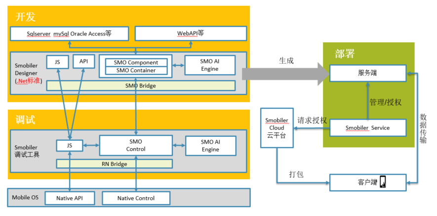

图 12 Smobiler整体机制

### 基于React Native前端技术

React Native
(简称RN)是Facebook于2015年4月开源的跨平台移动应用开发框架，是Facebook早先开源的JS框架
React
在原生移动应用平台的衍生产物，支持iOS和安卓两大平台[5]。RN使用Javascript语言，类似于HTML的JSX，以及CSS来开发移动应用，因此熟悉Web前端开发的技术人员只需很少的学习就可以进入移动应用开发领域。

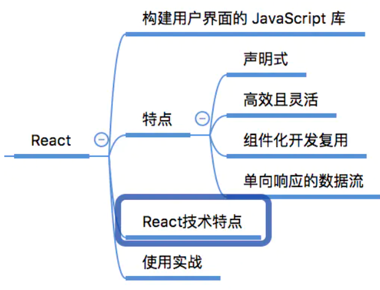

图 13 React特点

### PowerDesigner数据库设计软件

Power Designer
是Sybase公司的CASE工具集，使用它可以方便地对管理信息系统进行分析设计，他几乎包括了数据库模型设计的全过程[6][7]。利用Power
Designer可以制作数据流程图、概念数据模型、物理数据模型，还可以为数据仓库制作结构模型，也能对团队设计模型进行控制。他可以与许多流行的软件开发工具，例如PowerBuilder、Delphi、VB等相配合使开发时间缩短和使系统设计更优化。

## 数据库设计

根据需求分析与范式规则，本文对系统的数据库进行构建。

-   用户与车辆是一对多的关系，一个人可以拥有多辆车，而一辆车只能被一个人拥有。

-   车辆与留言是一对多的关系，一辆车能有多个留言，而一个留言只能对应一辆车。

-   车辆和出入时间有一对多的关系，一辆车能有多个出入时间，而一个出入时间只能对应一辆车。

-   人员与待审核车辆为一对多的关系，一个人可以有多个待审核车辆，但是一个待审核车辆只能被一个人拥有。

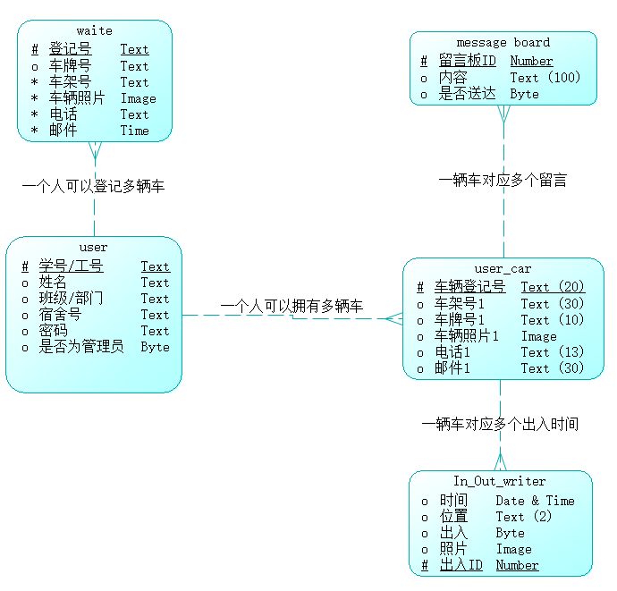

图 14 数据库概念模型设计（中文）

在数据库的物理模型中，用户可以作为车辆表与被等待车辆表的外键，而车辆的登记ID主键能作为消息表与进出表的外键。

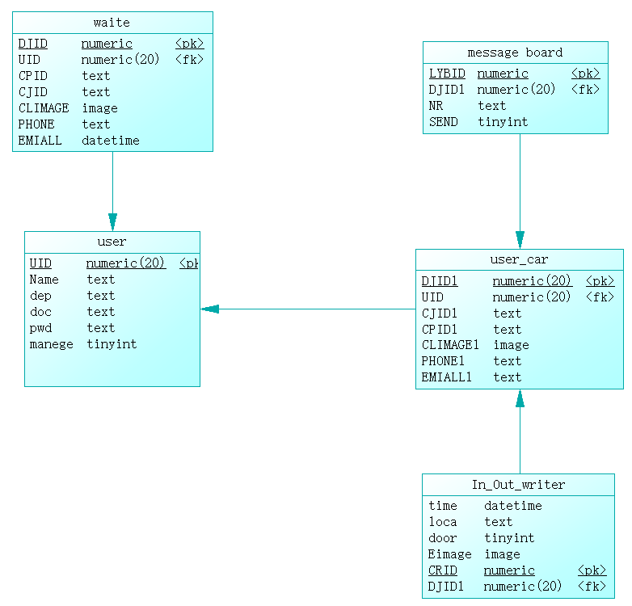

图 15数据库物理模型设计（英文）

生成最后进行小幅度修改，将SQL数据库关系图导出，如图 16所示。

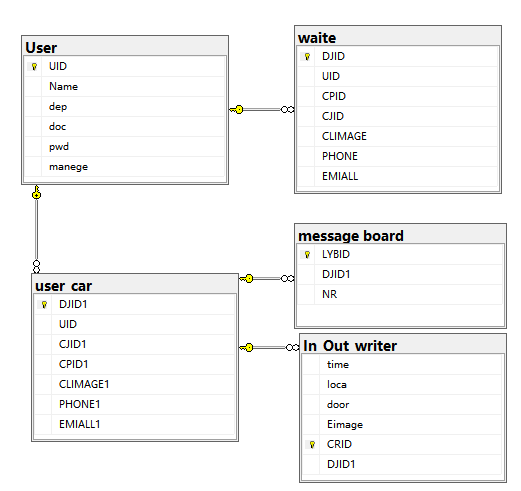

图 16 SQL数据库关系图

## 用户端与管理员端通用界面设计

### 用户登录与主页信息展示

在这一模块中用户在登录页面进行登录，并且可以使用记录密码来辨别。在后期会加入手势登录的多种登录方式，能够更加便捷的使用。登录成功之后会弹出登录成功的提示，窗口左上角点击按钮为侧边栏，能够展示个人的相应信息，以保证登录人员的正确性。查看本人车辆”按钮能够将本人所有的车辆都展示在自己面前。再点击下方“我的”按钮后，会显示出个人的相关信息，在此我们可以对个人的信息以及密码进行修改，并且可以有“退出登录”按钮。“

图 17 登录与查询信息功能序列图

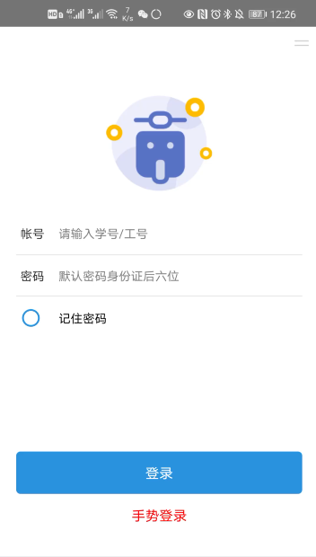
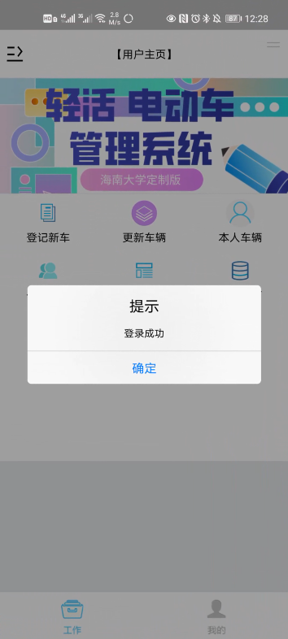

图 18登录页面（左图）和登录成功页面（右图）

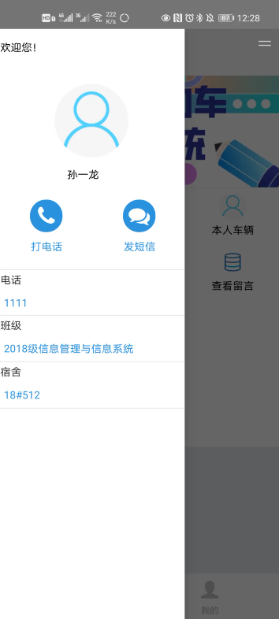

图 19 用户主页（左图）和侧边信息栏（右图）

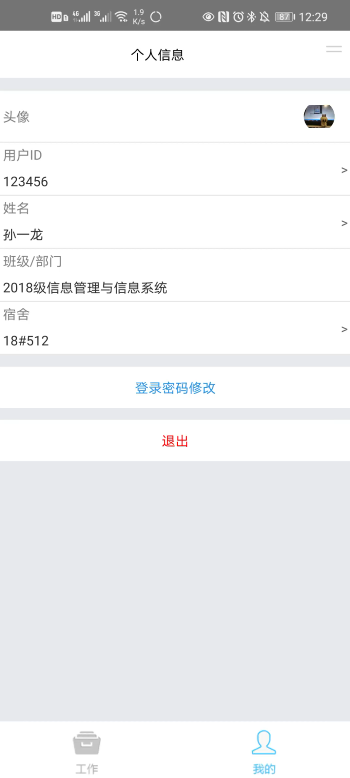
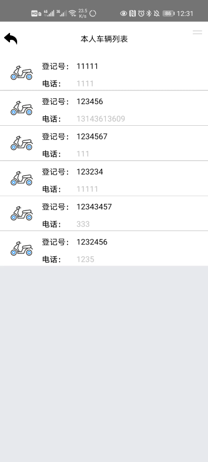

图 20 个人信息与退出登录页（左图）与本人车辆列表（右图）

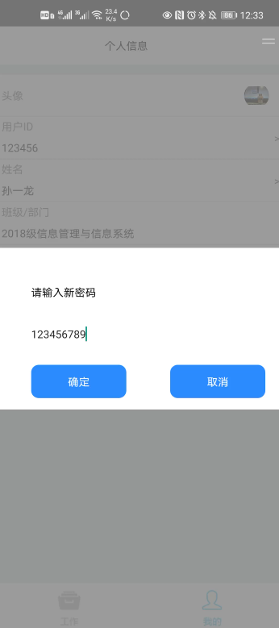
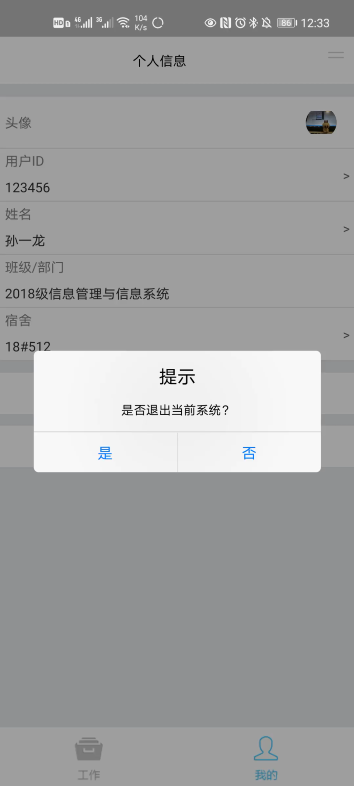

图 21 更新密码（左图）与退出系统（右图）

### 登记与修改车辆信息

我们可以点击登记行车，从而能够登记新车按照规定填写必填的内容，并且点击提交后，就可在系统内录入自己车辆信息。在登陆新车之后发现自己有部分信息需要进行修改，或者是车辆遗失以及出售转让等行为后，可以对车辆的信息进行删除与修改，将能够从客户的角度对信息进行维护，从而大大降低了管理员的工作。

图 22登记与修改车辆信息序列图

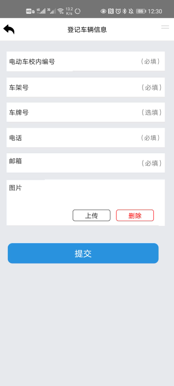
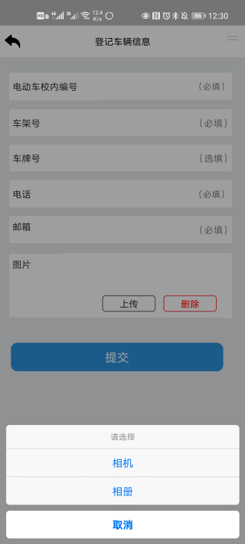

图 23 车辆信息登记页（左图）与图片选择栏（右图）

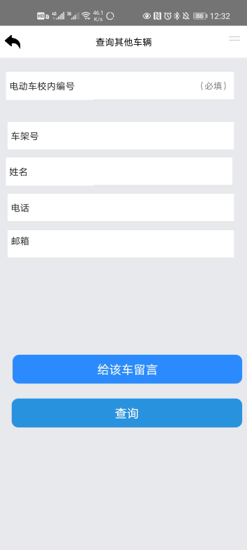

图 24 模糊查询其他车辆（右图）

### 查询车辆信息与留言功能

点击“他人车辆”，可以对他人的车辆根据电动车校内编号进行模糊查询，为保障私人信息不被泄露我们将留言板块加之其中。能够在保证隐私信息不被泄露，同时建立起双方沟通的桥梁，并且点击留言后，车主能够及时收到信息的推送，并且根据留言内容所进行相应的回复。

图 25 查询车辆信息与留言功能序列图

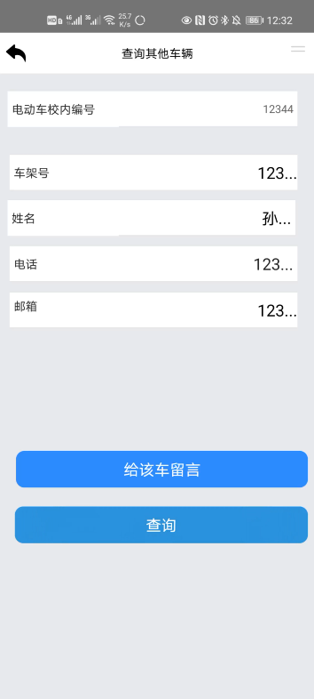
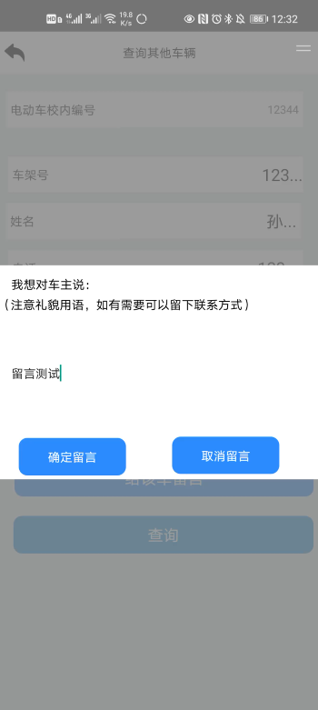

图 26成功模糊查询页面（左图）和留言页面（右图）

图 27 用户主页无法打开“所有信息”提示（左图）与留言板展示（右图）

## 管理员端专有页面设计

管理员账户登录后，可以对于车辆进行。最完整的查找，并且能够显示所有的信息，后续会考虑增加辅导员的电话，直接显示，并且会弹出同宿舍的其他人员电话，以便方便联系，点击电话联系，能够直接跳转到电话联系的窗口，大大降低了复制粘贴或者是手术电话的时间成本。

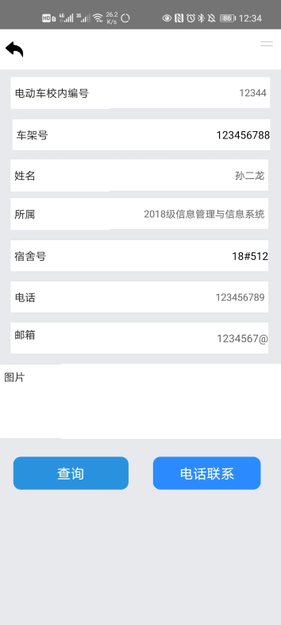
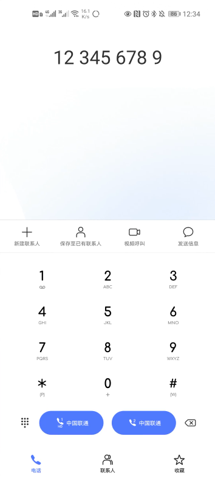

图 29
管理员主页（左图）、查询所有信息页面（中图）和“电话联系”按钮自动跳转（右图）

# 第四章 系统实施

## 工程概况

本系统主要在windows10环境的Visual
Studio2017、Android系统与华为鸿蒙系统下进行开发。在Visual
Studio2017下工程名叫“电动车管理系统V2.0”。项目内除系统文件外包含以下admin（管理员界面文件夹）、Contral（控制控件文件夹）、frmclass（继承类文件夹）、User（用户界面文件夹），在目录下还有登录窗体（Logon.cs）、电脑测试端窗体（frmGenerateQRcode.cs、frmHelp.cs、frmMain.cs、frmSetting.cs）与类文件（数据库类DBHelper.cs、全局变量类MobileGlobal.cs、数据库连接类SqlCommon.cs）

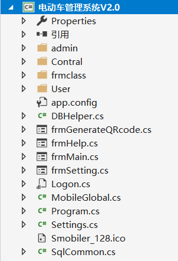

图 30项目展示

### Admin文件夹

Admin文件夹内主要由管理员工作页面adminwork.cs与管理员专属的查找全部界面Findall.cs构成。

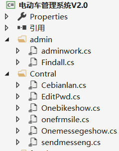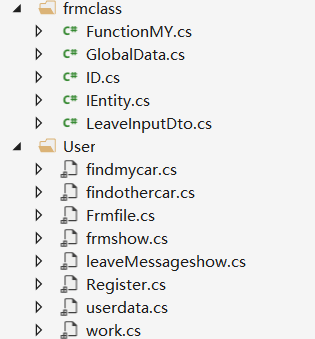

图 31 项目文件夹展示

### Contral文件夹

文件夹包括控制控件等多种控件。其中包含侧边栏Cebianlan.cs、修改密码控件EditPwd.cs、电动车单条数据概要展示控件Onebikeshow.cs、文件单条数据概要展示控件onefrmsile.cs、留言单条数据概要展示控件Onemessegeshow.cs、发送留言填写控件sendmesseng.cs。

### User文件夹

文件夹中包括用户主要的窗口页面。其中包含查看自身车辆窗口findmycar.cs、模糊查找他人车辆窗口findothercar.cs、文件展示窗口Frmfile.cs、查看本人所有车辆窗口frmshow.cs、查看留言查看留言窗口leaveMessageshow.cs、登记登记信息窗口Register.cs、人员信息窗口userdata.cs、主页窗口work.cs。

### Frmclass文件夹

文件夹中主要存放类的相关文件。其中包括功能类FunctionMY.cs、全局变量类GlobalData.cs、ID记录类ID.cs、接口lEntity.cs、输入类LeavelnputDto.cs

## 部分代码实现

### 登录界面按钮

>   登录按钮中考虑考虑到了密码错误与记住密码密码等操作。

| GlobalData.administrator = save.Tables[0].Rows[0][5].ToString();  if (save.Tables[0].Rows.Count \<= 0)  throw new Exception("用户不存在，请重新输入!");  string pwd = save.Tables[0].Rows[0][4].ToString();  //密码第五行row是4  if (pwd ==Pwd)  {  MessageBox.Show("登录成功");  GlobalData.administrator = save.Tables[0].Rows[0][5].ToString();  work work1 = new work();  this.Show(work1);   }  else  {  throw new Exception("密码不正确，请重试!");  }  SqlCon.Close();  if (chkRememberPwd.Checked==true)  {  LoadClientData("pwd", Pwd);  ReadClientData("pwd", (object s, ClientDataResultHandlerArgs args) =\>  {  if (string.IsNullOrEmpty(args.error))  {  Toast("密码为：" + args);  }  }); } |
|------------------------------------------------------------------------------------------------------------------------------------------------------------------------------------------------------------------------------------------------------------------------------------------------------------------------------------------------------------------------------------------------------------------------------------------------------------------------------------------------------------------------------------------------------------------------------------------------------------------------------------------------------------------------------------------------------------|

### 数据库连接语句

先对文本框内容进行监测，保证不会出现其他错误，再用SqlDataAdapter对内容进行获取。

| string userID = txtTel.Text.Trim(); string Pwd = txtPwd.Text.Trim(); if (string.IsNullOrEmpty(userID))  throw new Exception("请输入用户名！"); if (string.IsNullOrEmpty(Pwd))  throw new Exception("请输入密码！"); //数据库连接 string connectionString = "Data Source=DESKTOP-S8S50FR\\\\SQLEXPRESS;Initial Catalog=EVMS;Integrated Security=True"; SqlConnection SqlCon = new SqlConnection(connectionString); //数据库连接 SqlCon.Open(); //打开数据库 string sql = "Select \* from [User] where UID='" + userID + "'" ;//查找用户sql语句 SqlDataAdapter find = new SqlDataAdapter(sql, SqlCon); DataSet save = new DataSet(); find.Fill(save); |
|-----------------------------------------------------------------------------------------------------------------------------------------------------------------------------------------------------------------------------------------------------------------------------------------------------------------------------------------------------------------------------------------------------------------------------------------------------------------------------------------------------------------------------------------------------------------------------------------------------------------------------------------------------|

### 系统回退键代码编写

利用HandleToast方法结合toasttime计时器，来做出单次返回会提醒，两次返回会退出的操作。

| private void SmobilerForm1_KeyDown(object sender, KeyDownEventArgs e) {  if (e.KeyCode == KeyCode.Back)  { HandleToast();  } } private DateTime toasttime;//toast时间  private void HandleToast() {  if (toasttime.AddSeconds(3) \>= DateTime.Now)  { this.Client.Exit();  }  else  { toasttime = DateTime.Now; this.Toast("再按一次退出系统", ToastLength.SHORT);  } } |
|-------------------------------------------------------------------------------------------------------------------------------------------------------------------------------------------------------------------------------------------------------------------------------------------------------------------------------------------------------------------------|

### Sql类的连接语句

|  class SqlCommon  { private static String ConStr = "Data Source=DESKTOP-S8S50FR\\\\SQLEXPRESS;Initial Catalog=EVMS;Integrated Security=True"; private static SqlConnection conn;  public static SqlConnection Conn {  get  { if (conn == null) {  conn = new SqlConnection(ConStr);  conn.Open(); } if (conn.State == ConnectionState.Closed) {  conn.Open(); } if (conn.State == ConnectionState.Broken) {  conn.Close();  conn.Open(); } return conn;  } } /// \<summary\> /// 执行SQL语句的方法 /// \</summary\> /// \<param name="CommandText"\>\</param\> /// \<returns\>\</returns\> public static int ExecuteCommand(string CommandText) {  SqlCommand cmd = new SqlCommand(CommandText, Conn);  int k = cmd.ExecuteNonQuery();  conn.Close();  return k; } public static DataSet ExecuteReTable(String CommandText, string SqlName) {  SqlDataAdapter Adapter = new SqlDataAdapter(CommandText, Conn);  //实例化DataSet对象  DataSet ds = new DataSet();  Adapter.Fill(ds, SqlName);  Conn.Close();  return ds; } /// \<summary\> /// 执行查询命令并返回值 /// \</summary\> /// \<param name="CommandText"\>\</param\> /// \<returns\>\</returns\> public static int ExecuteSelect(String CommandText) {  SqlCommand cmd = new SqlCommand(CommandText, Conn);  int k = (int)cmd.ExecuteScalar();  conn.Close();  return k; }  public static ArrayList ExecuteReArrList(String CommandText) {  ArrayList arr = new ArrayList();  //实例化一个SqlCommand对象来执行SQL命令  SqlCommand cmd = new SqlCommand(CommandText, Conn);  try  { //声明SqlDataReader对象读取SQL命令返回的数据 SqlDataReader reader = cmd.ExecuteReader(); while (reader.Read())//逐行读取数据 {  for (int i = 0; i \< reader.FieldCount; i++) arr.Add(reader[i]); }  }  catch (SqlException err)  { MessageBox.Show(err.ToString());  }  finally  { Conn.Close();  }  return arr; } |
|-----------------------------------------------------------------------------------------------------------------------------------------------------------------------------------------------------------------------------------------------------------------------------------------------------------------------------------------------------------------------------------------------------------------------------------------------------------------------------------------------------------------------------------------------------------------------------------------------------------------------------------------------------------------------------------------------------------------------------------------------------------------------------------------------------------------------------------------------------------------------------------------------------------------------------------------------------------------------------------------------------------------------------------------------------------------------------------------------------------------------------------------------------------------------------------------------------------------------------------------------------------------------------------------------------------------------------------------------------------------------------------------------------------------------------------------------------------------------------------------------------------------------------------------------------------------------------------------------------------------------------------------------------------------------------------------------------------------------------------------------------------------------------------------------------------------------------------------------------------------|

### 主页选择按钮代码

在主页中有部分按钮，并且会识别用户是否是管理员，判断部分功能部分功能可不可以使用。

| private void iconMenuView1_ItemPress(object sender, IconMenuViewItemPressEventArgs e) {  switch (e.Item.ID)  { case "Register":  Register Register1 = new Register();  this.Show(Register1);  break; case "Renew":  work work2 = new work();  this.Show(work2);  break; case "My":  show work3 = new show();  this.Show(work3);  break; case "Other":  findothercar work5 = new findothercar();  this.Show(work5);  break;  case "Liuyan":  leaveMessageshow work6 = new leaveMessageshow();  this.Show(work6);  break;  case "Suoyou":  { if (GlobalData.administrator == "1") {  Findall work8 = new Findall();  this.Show(work8);   } else {  Toast("非管理员不允许查询，如需查询更多信息请联系保卫处"); } break;  }  } } |
|------------------------------------------------------------------------------------------------------------------------------------------------------------------------------------------------------------------------------------------------------------------------------------------------------------------------------------------------------------------------------------------------------------------------------------------------------------------------------------------------------------------------------------------------------------------------------------------------------------------------------------------------------------------------------------------------------------------------------|

### 保存图片代码

| private void camera1_ImageCaptured(object sender, BinaryResultArgs e) {  if (string.IsNullOrEmpty(e.error))  {  if (imgL.ResourceID.Trim().Length \> 0) {  e.SaveFile(imgL.ResourceID, MobileResourceManager.DefaultImagePath);  e.SaveFile(imgL.ResourceID);//保存图片文件到本地运行项目的image文件夹中  imgL.Refresh();//当图片上传文件名相同时，刷新界面图片内容 } else {  e.SaveFile(e.ResourceID, MobileResourceManager.DefaultImagePath);  e.SaveFile(e.ResourceID);//保存图片文件到本地运行项目的image文件夹中  imgL.ResourceID = e.ResourceID;  }  } |
|--------------------------------------------------------------------------------------------------------------------------------------------------------------------------------------------------------------------------------------------------------------------------------------------------------------------------------------------------------------------------------------------------------------------------------------------------------------------------------------------------------------------------------------------------------------|

### 全局变量代码

为了方便在窗口之间传值，需要构建全局变量传值。

|  class GlobalData  { public static string UID; public static string CarID; public static string administrator; public static string pwd;  } |
|---------------------------------------------------------------------------------------------------------------------------------------------|

### 截取前N位string字符方法

| public string GetStr(string strInput, int intLen) {  strInput = strInput.Trim();  byte[] myByte = System.Text.Encoding.Default.GetBytes(strInput);  //Response.Write("getStr Function is::" + myByte.Length.ToString());  if (myByte.Length \> intLen)  { //截取操作 string resultStr = ""; for (int i = 0; i \< strInput.Length; i++) {  byte[] tempByte = System.Text.Encoding.Default.GetBytes(resultStr);  if (tempByte.Length \< intLen)  { resultStr += strInput.Substring(i, 1);  }  else  { break;  } } return resultStr + "...";  }  else  { return strInput;  } } |
|-----------------------------------------------------------------------------------------------------------------------------------------------------------------------------------------------------------------------------------------------------------------------------------------------------------------------------------------------------------------------------------------------------------------------------------------------------------------------------------------------------------------------------------------------------------------------------|

### 拨打电话与发送短信按钮

| private void tpTel_Press(object sender, EventArgs e) {  Client.TelCall(label4.Text); }  private void tpMes_Press(object sender, EventArgs e) {  Client.SendSMS("", label4.Text); } |
|------------------------------------------------------------------------------------------------------------------------------------------------------------------------------------|

# 目前不足与未来方向

### 完善操作处理方式

程序由于并未交付实际人员进行使用。故还有部分操作并未实现，例如可以汇总留言，对留言进行删除，并通过留言界面进行沟通。后期将多多进行测试，并完善功能。

### 完善界面

本文所涉及的程序虽然有了初步的美观，但是对于很多部分仍会很不足，未来会美化APP与相应的图标，向着扁平化、清新化前进。

### 增加功能

增加包括审核信息功能与智能识别留言中非法字符等具有实际应用价值的功能模块。

### 物联网应用

增加物联网识别进行出入门扫描。设立
电子门卫识别校内车牌信息功能：通过摄像头对车牌进行识别，同时可以记录车辆进出信息功能：记录车牌、时间与照片。

# 参考文献

>   [1]黄炜钢.基于移动端的中职学生宿舍管理系统的设计与实现[J].信息与电脑(理论版),2021,33(02):141-144.

>   [2]周坤泰. 海南省消费市场监管思路研究[D].海南大学,2019.

>   [3]韩炜,杨俊,陈逢文,张玉利,邓渝.创业企业如何构建联结组合提升绩效?——基于“结构—资源”互动过程的案例研究[J].管理世界,2017(10):130-149+188.

>   [4]朱勇.基于React
>   Native的移动办公应用开发实践[J].中国金融电脑,2017(04):56-60.

>   [5]肖静华,谢康,吴瑶,冉佳森.企业与消费者协同演化动态能力构建:B2C电商梦芭莎案例研究[J].管理世界,2014(08):134-151+179.

>   [6]张郑军.基于PowerDesigner数据建模研究与实践[J].山西煤炭管理干部学院学报,2013,26(04):126-128.

>   [7]杨蔚鸣.PowerDesigner在《数据库原理》实践教学中的应用[J].电脑知识与技术,2009,5(27):7723-7724.

